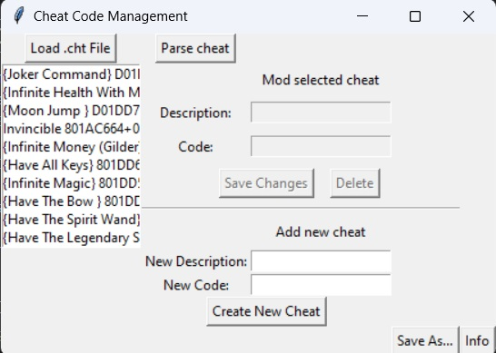

# CHT_Manager
CHT Maker is a user-friendly Python application for creating and managing cheat files (.cht) commonly used in emulators for video games. With CHT Maker, you can easily organize, edit, and create cheat codes for your favorite games, making it a valuable tool for gamers who enjoy enhancing their gaming experience. The tool provides an intuitive graphical interface, allowing users to load existing cheat files, modify cheat entries, and save their changes. Additionally, it supports the creation of new cheat entries, making it convenient for gamers to share and use cheat codes. CHT Maker simplifies the process of managing cheat codes, making gaming more enjoyable and customizable.

DOWNLOAD: [Latest Release](https://github.com/nsilveri/CHT_Manager/releases/latest)

    Main screen

  

HOW TO USE:

Advertisement:
    
    To ensure that the tool works, the .cht files must have the following standard structure:
        
        1) cheat = "number of cheats".
        2) cheat entries consisting of 3 elements 
            (description, code, enable state).
        
    All changes to the list of cheats in the tool are not really saved until you use the 'Save As...' button.

    

    Click on "Load .cht File" to load a .cht file:

  

    Loaded cht list:

  

    Editing selected item:

  

    Saving changed description or code:

  

    Making new item:

  

    Adding new item cheat:

  

    New item added:

  

    Parse cheat function:

      you can add new cheats simply pasting a list of cheats like this:

  

      
  Sintax:
      
    CHEAT_NAME(you can add a final numeber) CHEAT_CODE_1 CHEAT_CODE_2 ...

  

  

    Saving edited list in a cht file:

  

RELEASES:

    The release is made with "pyinstaller"

CHANGELOG:
    
    0.1: 
        Initial release
    ----
    0.1.1:
          Some GUI changes
    ----
    0.2: 
        Added parse cheats function
